# Project-Fruit-Shop
Fruit Stock Window Form Application C# .NET 4.7.2

#### Design | Login

 

#### Design | Main

 

#### Design | Order

 

#### Design | Customer List

 

#### Design | Product List

 

#### Design | Order summary

 

#### Design | Customer Detail

 

#### Design | Product Stock

 

#### Design | Add Product

 

#### Design | Stock History

 

#### Design | Order History

 

#### Design | Profile Employee

--------------------------------------------------------------------
#### login

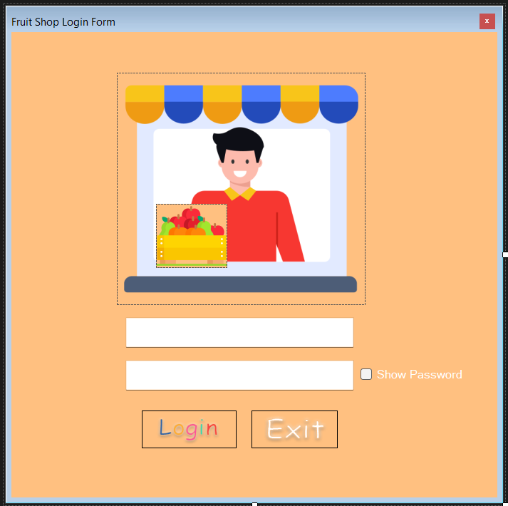
 

#### main

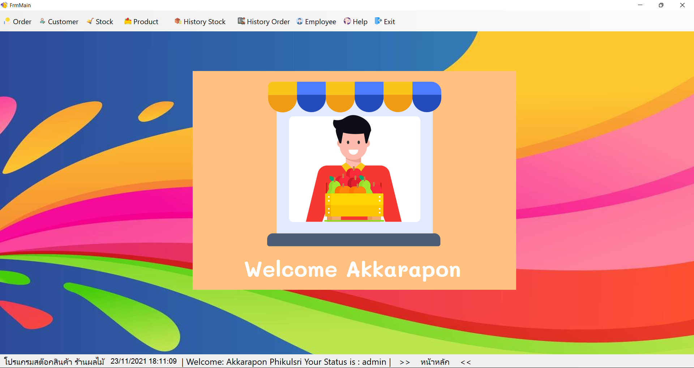
 

#### order

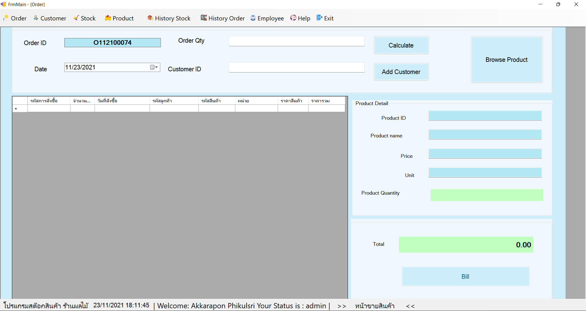
 

#### order-summary

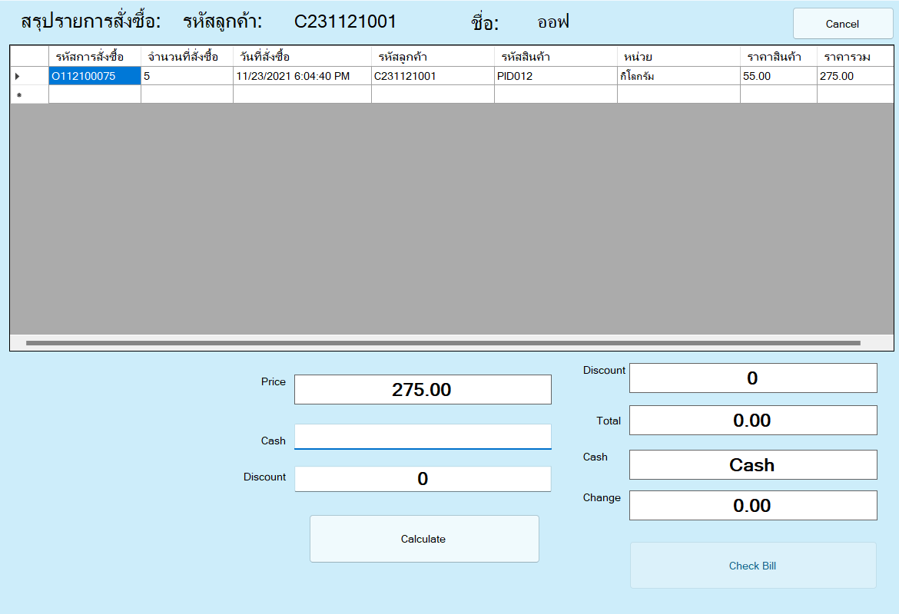
 

#### Bill

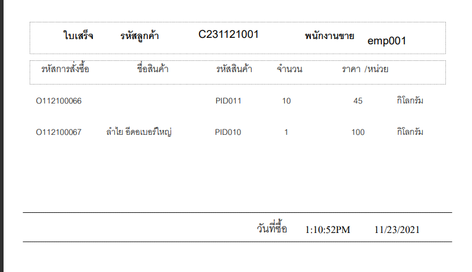

#### order history

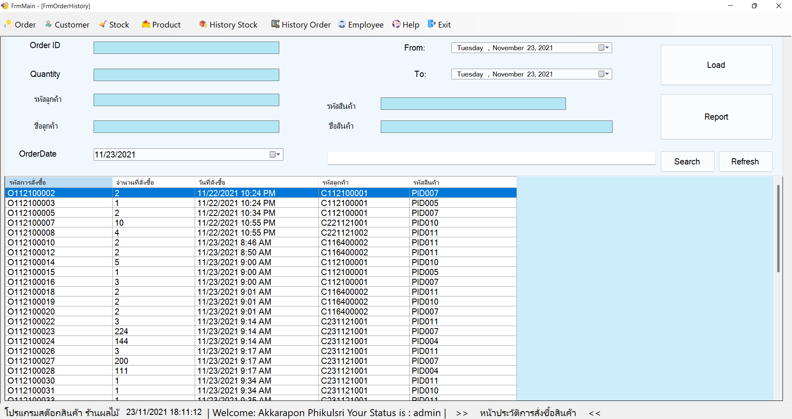
 

#### product list when click browse on order form

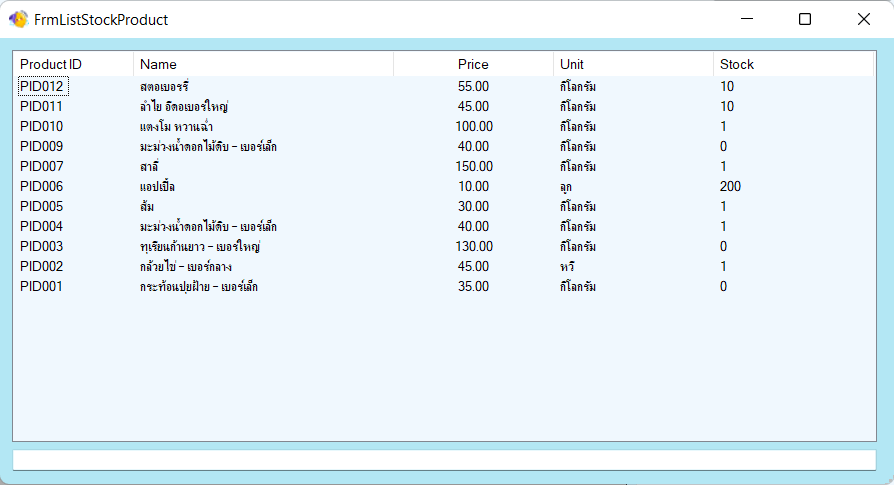
 

#### customer list when click customer on order form

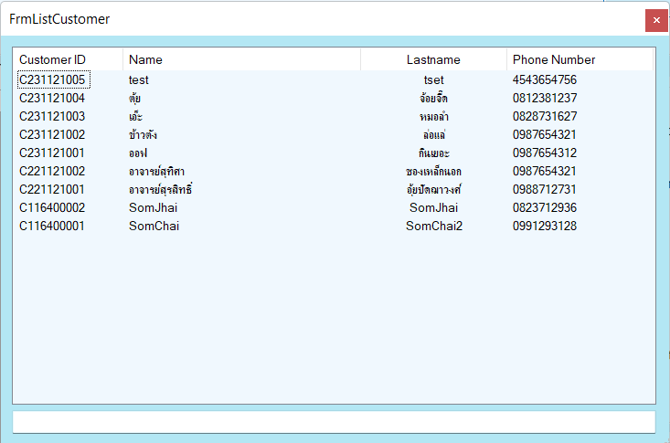
 

#### customer detail

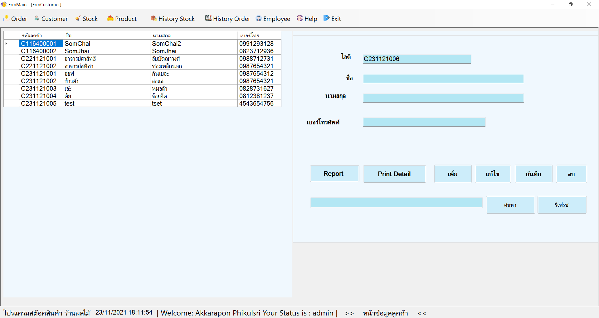
 

#### profile employee

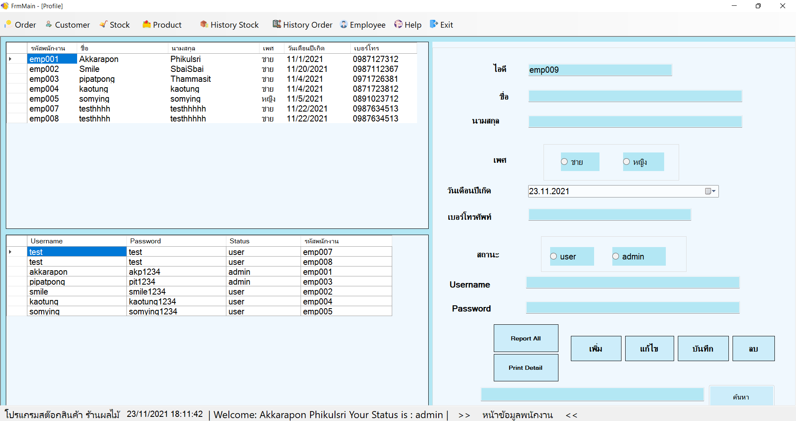
 

#### add product

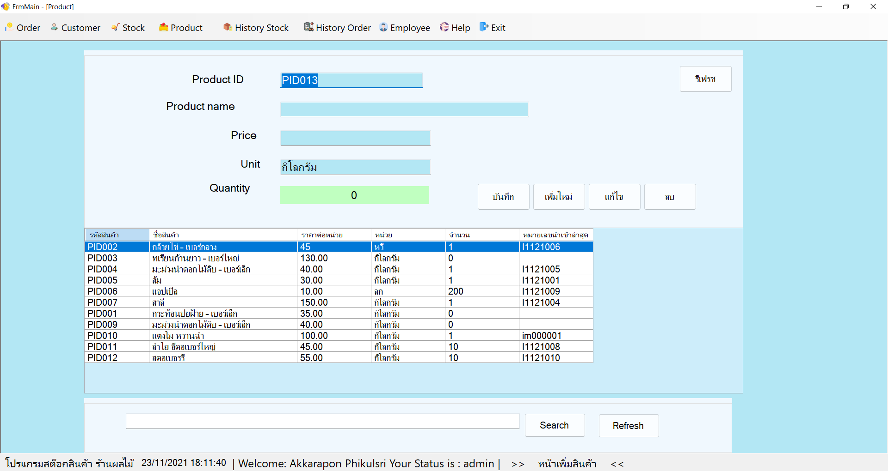
 

#### product stock

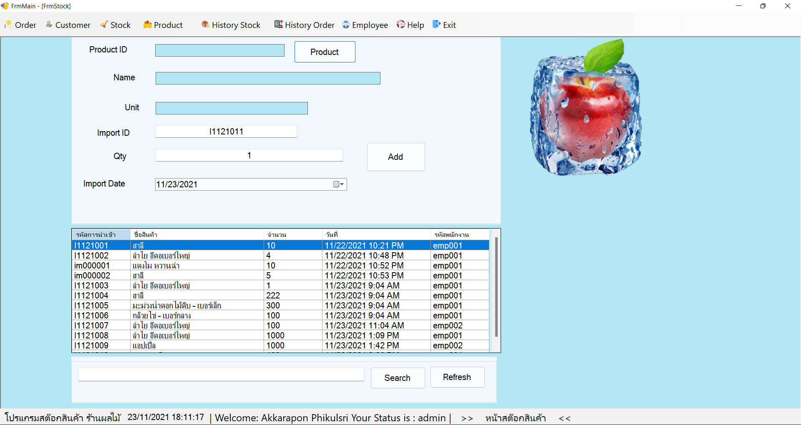
 

#### stock history

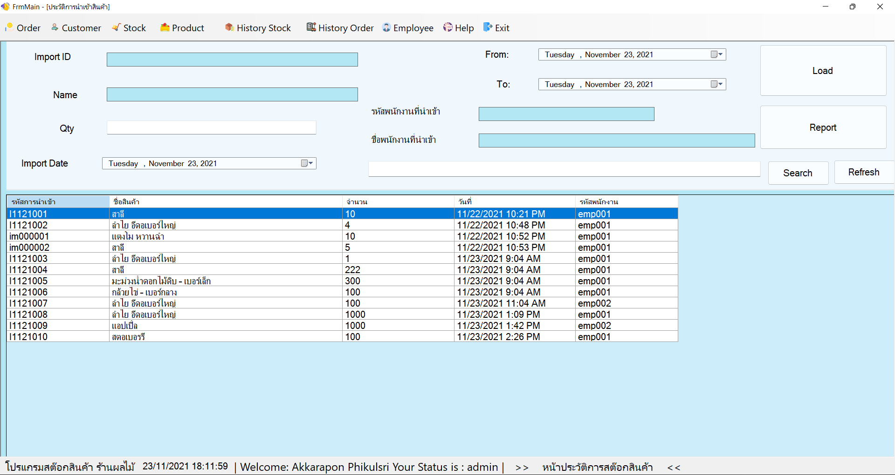
 

